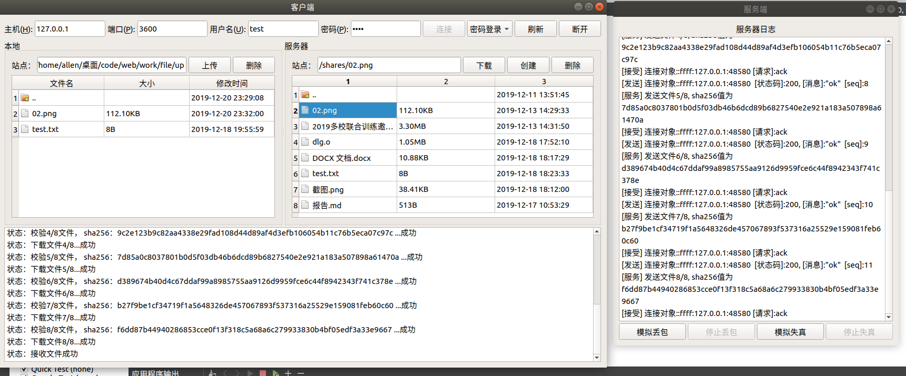

# Udp File Protocal

Network Homework By Qt

## 实现设计及结果

### 实验完成内容

#### 基础功能

1. 下层使用UDP协议（即使用数据报套接字完成本次程序）；

2. 完成客户端和服务器端程序；

3. 实现可靠的文件传输：能可靠下载文件，能同时下载文件。

#### 增设功能

1. 通过**三次握手**、**四次挥手**、**超时重传**实现UDP可靠文件传输

2. 实现多用户多线程

3. **用户权限设置**，限制用户访问文件的范围

4. 同时实现上传、下载、**新建文件夹**、**删除文件**、**获取目录**、**刷新**等操作

5. 通过sha-256安全散列算法，发送端给文件二进制打上哈希值，接受端验证，若哈希值不同则请求重传，**实现文件校验功能**。

6. 服务端实现**模拟丢包**和**模拟失真**，来验证超时重传和哈希证两个功能的效果。

### 实验设计

#### UDP报文设计

仿照tcp协议，设置`seq`，`ack`字段，并参考web应用前后端分离的传输模式，将UDP请求封装成json数据。

**发送端数据格式如下**

```json
{
    "cmd": "...",   
    "seq": "...",
    "ack": "...",
    "data": {}
}
```

`cmd`字段为具体请求命令，`seq`,`ack`同tcp，`data`为具体数据，命令包含如下请求：

| cmd命令字段 | 功能                     | 包含关键字                          | 解释                                                     |
| ----------- | ------------------------ | ----------------------------------- | -------------------------------------------------------- |
| hello       | 握手请求                 | syn                                 | TCP握手的SYN                                             |
| goodbye     | 挥手请求                 | fin                                 | TCP挥手的FIN                                             |
| auth        | 登录                     | user, password,anoy                 | 用户名，密码，是否匿名登录                               |
| ls          | 请求当前获取子目录和文件 | currentPath                         | 当前位于的目录                                           |
| mkdir       | 创建一个空文件夹         | name, currentPath                   | 创建名称，当前目录                                       |
| delete      | 删除一个文件或文件夹     | filePath                            | 文件名称（完整路径）                                     |
| upload      | 上传一个文件             | fileName, filePath, num, whole, bin | 文件名称，要上传的路径，块数，总块数，文件数据（Base64） |
| download    | 下载一个文件             | fileName, num, whole, bin           | 文件名称，块数，总块数，文件数据（Base64）               |
| ack         | 确认发送端的一个数据包   | ---                                 | ---                                                      |
| resend      | 请求重新发送上一个数据包 | ---                                 | ---                                                      |

**客户端数据格式如下**

```json
{
    "status": "...",
    "msg": "...", 
    "seq": "...",
    "ack": "...",
    "data": {}
}
```

`status`为状态码，`msg`为请求状态或错误

| status | msg  |
| ------ | ---- |
| 200    | ok |
| 400 | bad request |
| 401 | Unauthorized |
| 403 | Forbidden |

#### 文件传输设计

设发送端为A，接收端为B。

A将文件分成若干块发送，块大小在类中的`blockSize`由类变量设置。A在发送一块后，B接收到后返回ack确认命令，A直到收到B的响应后才发送下一块，若超时则重传（见下一条）。

由于A发送的数据包含其块数的信息和总数，所以B知道文件是否发送完成。

**注**：为防止传输过程中的中断导致文件不完整，B先将接收的文件块存到临时目录下，直到发送完成后再复制到实际目录下。

#### 可靠UDP传输的体现

1. 三次握手：客户端发送`hello`命令，服务端返回确认信息，然后客户端再发命令，建立连接
2. 四次挥手：A端发送`goodbye`命令，B端返回确认，B端发送`goodbye`，A端返回确认，连接断开。
3. **超时重传**：传输文件时，若3s无响应，则进行重传；重传3次仍无响应，则停止。

#### 文件哈希校验与重传机制

**sha-256**是一种安全散列算法，哈希碰撞率低，哈希结果为一个256位二进制。本实验中，发送端A对发送的每一块文件计算一个sha-256哈希值$hash_1$，附在`data`中；接收端B接受后，计算接收到的二进制文件哈希值$hash_2$，对比$hash_1$,$hash_2$是否相同，若不同则请求A重传。

这样可以有效解决二进制文件在传输过程中出现错误的情况。

具体实现在`sha256`类中。

#### 多线程机制

服务端通过记录发送端的IP和端口号唯一映射一个进程，`filethread`继承QT线程`QThread`类，接收不同客户端的数据包后，多线程处理。

#### 多用户权限管理设计

用户包含匿名用户、普通用户和管理员用户

| 用户类别   | 权限范围                                                 |
| ---------- | -------------------------------------------------------- |
| 匿名用户   | 只能对服务器shares文件夹下内容进行查看和操作             |
| 普通用户   | 只能对服务器shares和同用户名的文件夹下内容进行查看和操作 |
| 管理员用户 | 可查看和操作任何文件                                     |

用户信息在服务端提前设置好，保存在`config.json`中。

客户端首先进行登录，若客户端某次操作不在权限范围内，则返回401错误。

实现方法很简单，只需分析目录的前缀，和该用户权限是否一致即可。

## 结果截图

* 握手、登录、获取目录


* 权限（test用户为普通用户，无法访问admin）


* 上传


* 下载



* 模拟失真并重传


* 模拟丢包，超时重传


* 挥手

